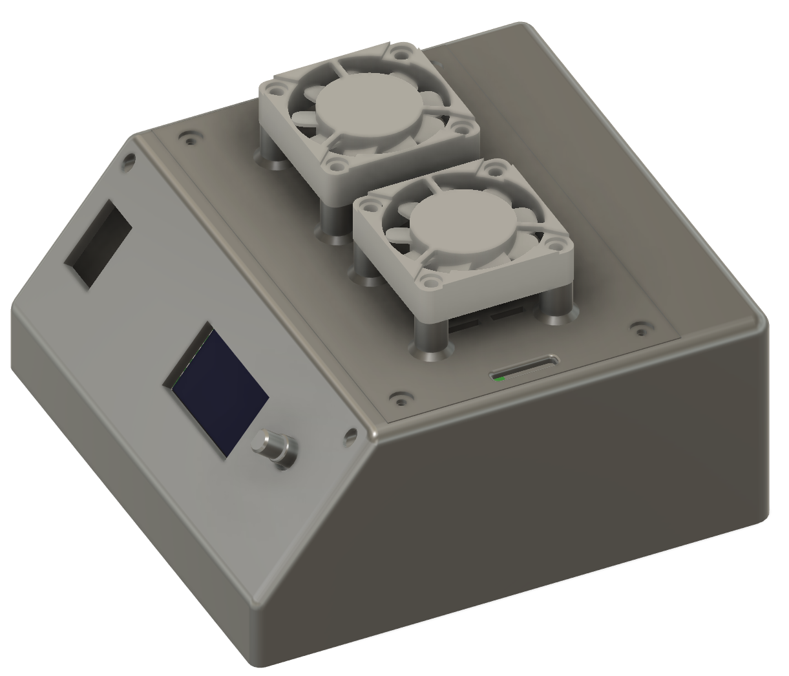

## DIY HotPlate/ReflowPlate

### Main Components:
* Arduino Nano
* Hot Plate 400W
* Universal mount board 7x9
* AC-DC down module (220V to 12V)
* SSR module (20A)
* OLED 1.3 display
* Encoder
* 12V Fan (x2)
* 1mm textolit plate
* NTC 3950 100К thermistor
* Time...

### Firmware Functions
* Custom Mode
* Reflow Mode
* Test Mode (for testing heater and fan)
* Supported SSD1306 and SH1106 display chip
* Supported PWM for SSR module
* Output temperature graphs